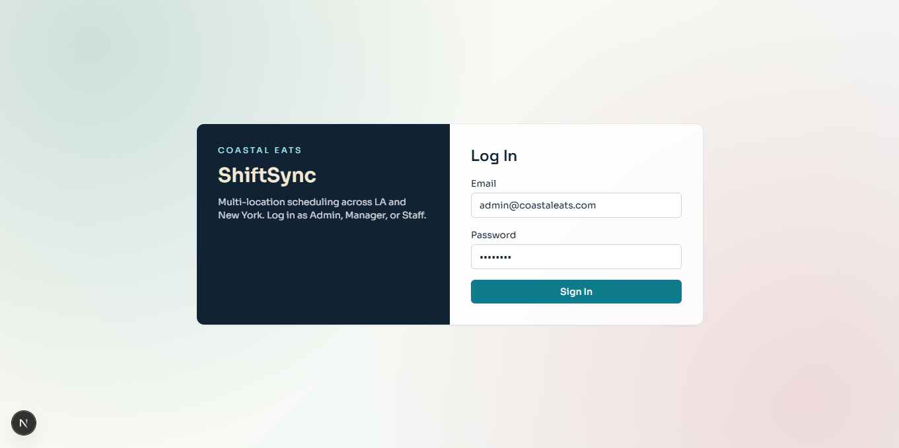
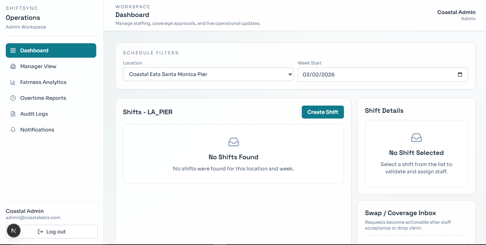
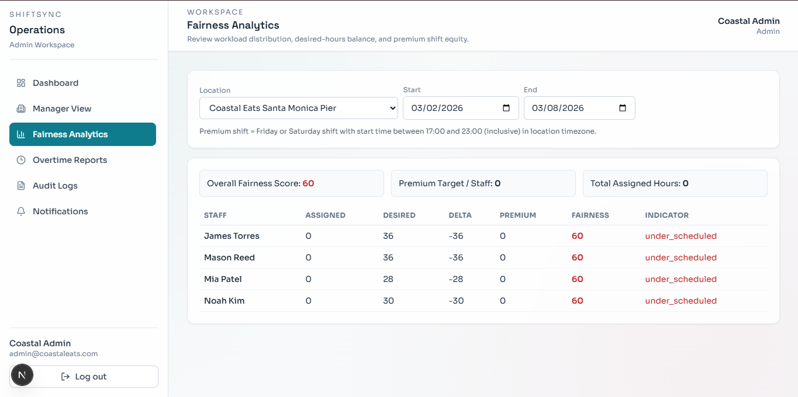

# ShiftSync Monorepo (MVP)

Foundational end-to-end MVP for **ShiftSync**, a multi-location staff scheduling platform for **Coastal Eats**.





## Stack

**Frontend**  


**Backend**  


**Database**  


**Deployment Targets**  


## Repo Layout

- `apps/api`: Express API
- `apps/web`: Next.js web app

Deployment runbook is in `docs/deploy.md` (Render + Netlify + Atlas).

## Live Deployment

- Web (Netlify): https://shiftsync-by-samson.netlify.app/login
- API Health (Render): https://shiftsync-nk81.onrender.com/health

Important for evaluators:

- The API is hosted on a **free Render instance**.
- Free Render services can sleep when idle and may take time to cold start.
- Before using the web app, open the API health URL and wait for a successful response, then load the web app.
- Expect occasional first-request delays after inactivity.

## Time Handling Decisions

- All shift times are stored in UTC in MongoDB (`startAtUtc`, `endAtUtc`).
- Shift creation/editing takes location-local inputs (`localDate`, `startLocalTime`, `endLocalTime`) and converts with Luxon.
- Overnight shifts are handled as one shift: if end time is <= start time, end is moved to the next day.
- UI/API responses also include location-local formatted output for display.
- Week grouping uses ISO Monday week start (`weekStartLocal`) in the location timezone.

## Ambiguity Decisions

- Desired hours vs availability:
  - `desiredWeeklyHours` is treated as a planning target for fairness analytics, not a hard scheduling block.
  - Availability violations still block assignment independently via validator rules.
  - Reason: desired hours represent preference/planning, while availability represents whether someone can legally/practically work at that time.
- De-certification impact on history:
  - Historical shifts/assignments/audit logs are immutable snapshots; de-certifying staff later does not rewrite past records.
  - Reason: history must stay accurate for audits and payroll; changing old records would create false history.
- Consecutive day counting:
  - Any shift touching a local calendar day counts that day as worked (overnight may count on two local dates).
  - Reason: labor checks are day-based in real operations, and this avoids undercounting overnight work.
- Shift edited after swap approval but before occurrence:
  - Approved swap is final for assignment ownership; later shift edits do not auto-revert approved changes.
  - Only non-final swap statuses are auto-cancelled on shift edit.
  - Reason: once manager-approved, ownership should be stable; only in-progress requests are safe to cancel automatically.
- Location spanning timezone boundary:
  - Each location is evaluated strictly in its own configured timezone; no cross-location blended timezone calculations.
  - Reason: one location must have one source-of-truth timezone so schedules, compliance, and payroll stay consistent.

## Local Setup

1. Install dependencies from repo root:

```bash
npm install
```

2. Configure environment variables:

- API: copy `apps/api/.env.example` to `apps/api/.env`
- Web: copy `apps/web/.env.example` to `apps/web/.env.local`

### API env template (`apps/api/.env`)

```env
PORT=4000
MONGODB_URI=mongodb+srv://<user>:<pass>@cluster.mongodb.net/shiftsync
JWT_SECRET=replace-with-strong-secret
JWT_EXPIRES_IN=8h
CLIENT_ORIGIN=http://localhost:3000
CUTOFF_HOURS=48
```

### Web env template (`apps/web/.env.local`)

```env
NEXT_PUBLIC_APP_NAME=ShiftSync
NEXT_PUBLIC_API_BASE_URL=http://localhost:4000
```

3. Seed database:

```bash
npm run seed
```

4. Run both apps in dev:

```bash
npm run dev
```

- Web: `http://localhost:3000`
- API: `http://localhost:4000`

## Workspace Scripts

- `npm run dev` - run api + web
- `npm run dev:api` - run only API
- `npm run dev:web` - run only web
- `npm run build` - build all workspaces
- `npm run seed` - seed MongoDB from `apps/api/src/seed.ts`
- `npm run test:e2e:install` - install Chromium for Playwright
- `npm run test:e2e` - run permanent web evaluator scenario suite (captures videos for all tests)
- `npm run test:e2e:headed` - run the same suite in headed mode

## Web E2E Scenario Suite

Permanent browser-based evaluator checks live in:

- `apps/web/e2e/prd-scenarios.spec.ts`
- `apps/web/e2e/helpers.ts`

Playwright config:

- `apps/web/playwright.config.ts`

What this suite validates from the actual web UI:

1. Overtime Trap (what-if impact and overtime driver visibility)
2. Timezone Tangle (cross-timezone overlap block)
3. Simultaneous Assignment (one winner, one conflict)
4. Fairness Complaint (premium-shift distribution visibility)
5. Regret Swap (creator cancellation before manager approval)
6. Sunday Night Chaos (drop claim + manager approval workflow)

Execution model:

- Tests run serially and intentionally mutate scenario state.
- Re-run `npm run seed` before each full suite run to reset baseline data.

Prerequisites for deterministic results:

1. Seed right before running:
   - `npm run seed`
2. First-time Playwright browser install:
   - `npm run test:e2e:install`
3. Use the seeded scenario week (default is computed automatically as next ISO week in `America/New_York`):
   - optional override: `E2E_WEEK_START=YYYY-MM-DD`

Run against local app (suite starts API + Web automatically):

```bash
npm run test:e2e
```

Local E2E runtime defaults:

- API target: `http://localhost:4001` (dedicated Playwright port)
- Web target: `http://localhost:3001` (dedicated Playwright port to avoid collisions with your normal `3000` dev server)
- Optional overrides: `E2E_LOCAL_API_PORT=4200 E2E_LOCAL_WEB_PORT=3200 npm run test:e2e`
- Fresh server boot is the default for deterministic runs (`E2E_REUSE_EXISTING_SERVER=0` behavior).
- Optional reuse (faster, less deterministic): `E2E_REUSE_EXISTING_SERVER=1 npm run test:e2e`
- Videos from successful/failed tests are saved under `apps/web/test-results/**/video.webm`.
- For dual-context capture in scenario 3, set `E2E_CAPTURE_SIMULTANEOUS_VIDEO=1` before running Playwright.
- Curated, scenario-labeled demo exports are stored in `apps/web/e2e-videos/latest`.

Run against deployed web instead of local dev servers:

```bash
E2E_BASE_URL=https://shiftsync-by-samson.netlify.app E2E_WEEK_START=2026-03-09 npm run test:e2e -w apps/web
```

Run against already-running local API/Web servers:

```bash
E2E_BASE_URL=http://localhost:3000 E2E_API_BASE_URL=http://localhost:4100 npm run test:e2e -w apps/web
```

Deployed run note:

- API is on Render free tier and can cold-start.
- Wake the API first: `https://shiftsync-nk81.onrender.com/health`
- Then run the suite against Netlify so first-page/API timeouts do not skew results.

## Seed Data Coverage

Seed script (`apps/api/src/seed.ts`) provides:

- 4 locations across 2 time zones (`America/Los_Angeles`, `America/New_York`)
- 3 managers mapped to assigned locations
- 12 staff with mixed skills and location certifications
- Staff profiles with realistic hourly rates for overtime-cost projection
- Recurring weekly availability rules + targeted one-off availability exceptions for deterministic demos
- Overnight shift: `23:00 -> 03:00` next day
- Hour-risk arrangement: one staff assigned 48h + extra 4h shift available (52h risk)
- Premium fairness setup: Friday/Saturday evening premium shifts concentrated on one staff
- Overlap conflict setup: classic LA overlap pair + cross-manager NYC overlap race pair
- Timezone tangle setup: dual-certified staff with seeded East assignment and West assignment candidate
- `Regret Swap Demo`: accepted swap request (Ava -> Benjamin) waiting for manager approval/cancel
- `Sunday Night Chaos`: upcoming Sunday `19:00-23:00` drop request open for claim + manager approval path

## Swap & Coverage Flow

Implemented workflow:

1. Staff member creates a `swap` or `drop` request from an assigned shift.
2. `swap`: targeted colleague accepts.
3. `drop`: eligible colleague claims.
4. Manager/admin approves or rejects.
5. Original assignment remains unchanged until manager approval commits.

Edge-case handling:

- Manager shift edits cancel all non-final swap/drop requests tied to the edited shift.
- Staff may have at most 3 active requests (`pending`, `accepted`, `claimed`) at once.
- Drop requests expire when shift start is within 24 hours or explicit `expiresAtUtc` is reached.
- API runs an idempotent expiry worker every 3 minutes to enforce drop expiration.

## Labor Compliance Rules

Assignment validation now includes labor compliance what-if impact and policy checks:

- Weekly hours: warning at `35+`
- Weekly hours above `40`: warning only (decision: allow with warning, do not hard-block)
- Daily hours above `8`: warning
- Daily hours above `12`: hard block
- 6th consecutive worked day (within the week): warning
- 7th consecutive worked day: hard block unless manager override is supplied with reason

Consecutive-day definition:

- Any shift touching a local calendar day counts that day as worked.
- For overnight shifts, each touched local calendar day is counted.

Override behavior:

- Assignment API accepts optional payload: `override: { allowSeventhDay: true, reason: string }`
- Override reason is persisted on `ShiftAssignment.overrideReason`
- Override event is written to `AuditLog`
- Validator response always includes `complianceImpact` for what-if projection.

## Fairness Analytics

Fairness report endpoint:

- `GET /reports/fairness?locationId&startDate&endDate`

Returned metrics per staff:

- total assigned hours in period
- premium shift count
- desired hours for period (from `desiredWeeklyHours`)
- delta (`assigned - desired`)
- fairness score and under/over/balanced indicator

Premium shift definition:

- Shift start falls on Friday or Saturday
- Start time in location timezone is between `17:00` and `23:00` inclusive

Scoring approach (defensible/simple):

- `premiumBalanceScore = 100 - ((abs(staffPremium - premiumTargetPerStaff) / max(1, premiumTargetPerStaff)) * 100)`
- `hoursBalanceScore = 100 - ((abs(assignedHours - desiredHoursForPeriod) / max(1, desiredHoursForPeriod)) * 100)`
- `fairnessScore = 0.6 * premiumBalanceScore + 0.4 * hoursBalanceScore` (clamped to `0-100`)
- overall fairness score is the average per-staff fairness score for certified staff in the location

## Audit Trail

Audit records persist:

- `actorId` (+ user linkage when actor is a user)
- `action`, `entityType`, `entityId`
- `locationId` when applicable
- `beforeSnapshot`, `afterSnapshot`
- timestamp (`createdAt`)

Covered change areas:

- shift create/edit/publish/unpublish
- assignment create/remove/reassign via swap approval
- swap lifecycle transitions (requested, accepted, claimed, approved, rejected, cancelled, expired)
- availability rule/exception create/update/delete

Audit endpoints:

- `GET /shifts/:id/audit` (manager/admin history view)
- `GET /audit/export?locationId&start&end&format=json|csv` (admin export)

## Test Login Credentials

All seeded users use password: `Pass123!`

- Admin: `admin@coastaleats.com`
- Manager (LA): `maya.manager@coastaleats.com`
- Manager (NYC Midtown): `victor.manager@coastaleats.com`
- Manager (NYC Brooklyn): `riley.manager@coastaleats.com`
- Staff (swap/drop): `ava.staff@coastaleats.com`
- Staff (coverage claim): `benjamin.staff@coastaleats.com`
- Staff (overtime trap): `ethan.staff@coastaleats.com`

## Evaluator Live Demo Script (One-Page)

This is a single linear flow that demonstrates all 6 PRD evaluator scenarios after `npm run seed`.

Pre-flight:

- Run seed against the same environment you will demo.
- Scenario week is seeded as **next ISO week** from seed runtime.
- Example: if seeded on **March 4, 2026**, use **week start March 9, 2026** and **Sunday March 15, 2026**.

> Embedded playback note: most markdown renderers support these inline videos, but autoplay behavior depends on the viewer. Each row also includes direct links as fallback.

<table>
  <thead>
    <tr>
      <th width="62%">Timeline + Steps</th>
      <th width="38%">Demo Video</th>
    </tr>
  </thead>
  <tbody>
    <tr>
      <td>
        <strong><code>00:00-01:00</code> Setup</strong><br />
        - Log in as <code>victor.manager@coastaleats.com</code>.<br />
        - Open <code>/manager</code> and set <strong>Week Start</strong> to seeded Monday.<br />
        - Companion clip uses the opening of Scenario 1.
      </td>
      <td>
        <video src="apps/web/e2e-videos/latest/01-overtime-trap.webm" controls muted playsinline preload="metadata" width="360"></video><br />
        <a href="apps/web/e2e-videos/latest/01-overtime-trap.webm">Open clip</a>
      </td>
    </tr>
    <tr>
      <td>
        <strong><code>01:00-04:00</code> Scenario 1 - Sunday Night Chaos</strong><br />
        - Log out and log in as <code>benjamin.staff@coastaleats.com</code>.<br />
        - Open <code>/staff#available-drops</code>, claim <code>Sunday Night Chaos</code>.<br />
        - Log out and log in as <code>victor.manager@coastaleats.com</code>.<br />
        - Open <code>/manager#swap-inbox</code>, approve claimed drop request.<br />
        - Callout: original assignment remains until approval; realtime swap events and notifications fire at each step.
      </td>
      <td>
        <video src="apps/web/e2e-videos/latest/06-sunday-night-chaos.webm" controls muted playsinline preload="metadata" width="360"></video><br />
        <a href="apps/web/e2e-videos/latest/06-sunday-night-chaos.webm">Open clip</a>
      </td>
    </tr>
    <tr>
      <td>
        <strong><code>04:00-07:00</code> Scenario 2 - Overtime Trap</strong><br />
        - In <code>/manager</code>, select <code>High-Hours Prep Block 13</code>.<br />
        - Choose <code>Ethan Lopez</code> and show what-if impact (<code>projectedWeeklyHours</code> reaches 52).<br />
        - If 7th-day block appears, enter override reason and confirm assignment with override.<br />
        - Open <code>/overtime</code> (Midtown, same week) and show overtime premium + overtime-driving assignment line item.
      </td>
      <td>
        <video src="apps/web/e2e-videos/latest/01-overtime-trap.webm" controls muted playsinline preload="metadata" width="360"></video><br />
        <a href="apps/web/e2e-videos/latest/01-overtime-trap.webm">Open clip</a>
      </td>
    </tr>
    <tr>
      <td>
        <strong><code>07:00-09:00</code> Scenario 3 - Timezone Tangle</strong><br />
        - Log out and log in as <code>maya.manager@coastaleats.com</code>.<br />
        - In <code>/manager</code> at LA_DT, select <code>Timezone Tangle West</code>.<br />
        - Attempt to assign <code>Benjamin Price</code>.<br />
        - Callout: blocked by timezone-aware overlap with seeded <code>Timezone Tangle East</code> assignment.
      </td>
      <td>
        <video src="apps/web/e2e-videos/latest/02-timezone-tangle.webm" controls muted playsinline preload="metadata" width="360"></video><br />
        <a href="apps/web/e2e-videos/latest/02-timezone-tangle.webm">Open clip</a>
      </td>
    </tr>
    <tr>
      <td>
        <strong><code>09:00-12:00</code> Scenario 4 - Simultaneous Assignment</strong><br />
        - Open two windows.<br />
        - Window A: <code>victor.manager@coastaleats.com</code> on <code>Simultaneous Assignment Midtown</code>.<br />
        - Window B: <code>riley.manager@coastaleats.com</code> on <code>Simultaneous Assignment Brooklyn</code>.<br />
        - In both windows choose <code>Ava Ramirez</code> and click <strong>Confirm Assign</strong> nearly simultaneously.<br />
        - Expected: one succeeds, one fails with conflict feedback.
      </td>
      <td>
        <video src="apps/web/e2e-videos/latest/03-simultaneous-assignment-victor.webm" controls muted playsinline preload="metadata" width="360"></video><br />
        <a href="apps/web/e2e-videos/latest/03-simultaneous-assignment-victor.webm">Open Victor clip</a><br /><br />
        <video src="apps/web/e2e-videos/latest/03-simultaneous-assignment-riley.webm" controls muted playsinline preload="metadata" width="360"></video><br />
        <a href="apps/web/e2e-videos/latest/03-simultaneous-assignment-riley.webm">Open Riley clip</a>
      </td>
    </tr>
    <tr>
      <td>
        <strong><code>12:00-14:00</code> Scenario 5 - Fairness Complaint</strong><br />
        - Log in as <code>riley.manager@coastaleats.com</code>, open <code>/fairness</code>.<br />
        - Select Brooklyn and seeded Monday-Sunday date range.<br />
        - Show premium shift distribution + fairness score to verify/refute Saturday-night complaint.
      </td>
      <td>
        <video src="apps/web/e2e-videos/latest/04-fairness-complaint.webm" controls muted playsinline preload="metadata" width="360"></video><br />
        <a href="apps/web/e2e-videos/latest/04-fairness-complaint.webm">Open clip</a>
      </td>
    </tr>
    <tr>
      <td>
        <strong><code>14:00-16:00</code> Scenario 6 - Regret Swap</strong><br />
        - Log in as <code>ava.staff@coastaleats.com</code>, open <code>/staff#swap-requests</code>.<br />
        - Cancel accepted <code>Regret Swap Demo</code> before manager action.<br />
        - Log in as <code>victor.manager@coastaleats.com</code>, confirm it is no longer actionable.<br />
        - Callout: assignment stays with original owner after cancellation.
      </td>
      <td>
        <video src="apps/web/e2e-videos/latest/05-regret-swap.webm" controls muted playsinline preload="metadata" width="360"></video><br />
        <a href="apps/web/e2e-videos/latest/05-regret-swap.webm">Open clip</a>
      </td>
    </tr>
    <tr>
      <td>
        <strong><code>16:00-18:00</code> Wrap-up</strong><br />
        - Optional: <code>/on-duty</code> live roster and <code>/audit</code> shift history/export.<br />
        - Recap: constraints, swaps/drops, overtime what-if, fairness analytics, realtime updates, audit trail.<br />
        - Companion clip uses the closing of Scenario 6.
      </td>
      <td>
        <video src="apps/web/e2e-videos/latest/06-sunday-night-chaos.webm" controls muted playsinline preload="metadata" width="360"></video><br />
        <a href="apps/web/e2e-videos/latest/06-sunday-night-chaos.webm">Open clip</a>
      </td>
    </tr>
  </tbody>
</table>

## MVP API Surface

- `GET /health`
- `POST /auth/login`
- `GET /auth/me`
- `GET /notifications`
- `POST /notifications/mark-read`
- `PATCH /notifications/:id/read`
- `PATCH /users/me/notification-preferences`
- `POST /shifts`
- `GET /shifts?locationId&weekStart`
- `PATCH /shifts/:id`
- `POST /shifts/:id/publish`
- `POST /shifts/:id/unpublish`
- `POST /shifts/:id/assign`
- `POST /shifts/:id/clock-in`
- `POST /shifts/:id/clock-out`
- `POST /shifts/:id/validate-assign/:staffId`
- `DELETE /shifts/:id/assignments/:assignmentId`
- `GET /shifts/:id/audit`
- `GET /reports/overtime?locationId&weekStart`
- `GET /reports/fairness?locationId&startDate&endDate`
- `GET /audit/export?locationId&start&end&format=json|csv`
- `GET /staff?locationId=<id>`
- `GET /staff/:id/availability`
- `POST /staff/:id/availability-rules`
- `PATCH /staff/:id/availability-rules/:ruleId`
- `DELETE /staff/:id/availability-rules/:ruleId`
- `POST /staff/:id/availability-exceptions`
- `PATCH /staff/:id/availability-exceptions/:exceptionId`
- `DELETE /staff/:id/availability-exceptions/:exceptionId`
- `GET /on-duty?locationId=<id>`
- `GET /swap-requests?mine=true`
- `GET /swap-requests?available=true`
- `GET /swap-requests?managerInbox=true`
- `GET /swap-requests/eligible-staff?shiftId=<id>`
- `POST /swap-requests`
- `POST /swap-requests/:id/accept`
- `POST /swap-requests/:id/claim`
- `POST /swap-requests/:id/cancel`
- `POST /swap-requests/:id/approve`
- `POST /swap-requests/:id/reject`
- `GET /analytics/schedule-health` (placeholder, returns 501)

## Realtime Features

Socket rooms:

- `user:{userId}`
- `location:{locationId}` (joined by manager/admin sockets)

Implemented events:

- `schedule_published`
- `schedule_updated`
- `shift_created`
- `shift_updated`
- `assignment_created`
- `assignment_removed`
- `notification_created`
- `on_duty_updated`
- `swap_requested`
- `swap_updated`
- `swap_cancelled`
- `conflict_detected`

Behavior highlights:

- Staff schedule views refresh live on `schedule_published` and `schedule_updated`.
- Manager week view refreshes live on shift/assignment schedule events.
- Notifications are persisted and pushed live via `notification_created`.
- On-duty view updates live per location via `on_duty_updated`.
- Concurrent assignment conflicts emit `conflict_detected` to manager user room.
- Swap/drop lifecycle transitions emit realtime updates through `swap_requested`, `swap_updated`, and `swap_cancelled`.

## Frontend Architecture Rules

- Routing is Pages Router only (`apps/web/src/pages`).
- No Next.js API proxy routes are used.
- All backend calls from the web app go through `apps/web/src/lib/api` Axios wrappers.
- JWT is stored in browser `localStorage` for take-home speed/simplicity.
  - This is intentionally temporary and should be upgraded to httpOnly cookies in production.

## Layout & Navigation Architecture

- Protected pages render inside `AppLayout` (`apps/web/src/components/layout/AppLayout.tsx`).
- `AppLayout` provides:
  - persistent desktop sidebar
  - mobile slide-in drawer with backdrop, ESC close, and keyboard focus trap
  - top header with route-derived page title plus current user identity
- Sidebar logic is centralized in:
  - `apps/web/src/components/navigation/Sidebar.tsx`
  - `apps/web/src/components/navigation/nav-config.ts`
- Navigation is role-aware:
  - Admin: dashboard, manager view, fairness, overtime, audit, notifications
  - Manager: dashboard, on-duty, overtime, fairness, swap inbox, notifications
  - Staff: my shifts, available drops, swap requests, notifications
- Logout is client-side and stateless:
  - clear JWT from `localStorage`
  - disconnect Socket.IO client
  - redirect to `/login`

## Loading States

- Skeleton system lives in `apps/web/src/components/skeleton`:
  - `Skeleton.tsx`: base pulse block
  - `PageSkeleton.tsx`: full page-level loading scaffold (supports auth/loading shell with sidebar)
  - `TableSkeleton.tsx`: tabular report placeholders
  - `CardListSkeleton.tsx`: card/list placeholders for shifts, inboxes, and notifications
  - `SidebarSkeleton.tsx`: placeholder sidebar used during auth/user bootstrap
- Shared state components live in `apps/web/src/components/state`:
  - `EmptyState.tsx`
  - `ErrorState.tsx`
- Pattern for protected pages:
  - auth loading: render `PageSkeleton` with `withLayout`
  - data loading: render page-specific skeletons (`TableSkeleton` or `CardListSkeleton`)
  - errors: render `ErrorState` with optional retry action
  - empty results: render `EmptyState`
- `AppLayout` supports consistent page title/subtitle, spacing, and `aria-busy` for loading accessibility.

## Assignment Concurrency Model

Assignment creation now uses a lock + transaction + revalidation sequence to prevent race conditions:

1. Acquire reservation lock in `Lock` collection with key `staff:{staffId}` and TTL ~15 seconds.
2. Start MongoDB transaction (Mongoose session).
3. Re-run `validateAssignment(...)` inside the same transaction/session.
4. Create `ShiftAssignment` and notifications in the transaction.
5. Commit transaction.
6. Release lock in `finally` (TTL remains as safety if release fails).

Conflict handling:

- If lock acquisition fails, API returns `409` with `code: "conflict_detected"` and emits `conflict_detected` to manager room `user:{userId}`.
- If revalidation fails inside transaction, API returns `409` with `code: "conflict_detected"` plus violations/suggestions, and emits `conflict_detected`.
- On success, API emits `assignment_created` to `location:{locationId}` so managers refresh without full page reload.
- 7th-day override assignment path persists manager reason in assignment + audit trail.

## RBAC Rules Implemented

- Admin: full visibility and management actions
- Manager: management actions restricted to assigned locations
- Staff: can only view published shifts for certified locations, plus their own assignments

## Manual Test Steps

1. Run seed and log in as manager (`maya.manager@coastaleats.com`).
2. Confirm web uses Pages routes:
   - `/login`, `/dashboard`, `/manager`, `/staff`, `/notifications`, `/on-duty`, `/overtime`, `/fairness`, `/audit` (admin only)
3. Confirm API calls are direct to `NEXT_PUBLIC_API_BASE_URL` by checking the browser network tab (no `/api/*` requests).
4. In manager dashboard, switch locations and week start; confirm only assigned locations appear.
5. Select a shift in manager dashboard and test assignment constraints:
   - `Unavailable Test Shift` + `Ava Ramirez` => availability violation
   - `Brunch Rush` + non-barista staff => required skill violation
   - `Uncertified Test Shift` + NYC-only staff => location certification violation
   - `Timezone Tangle West` + `Benjamin Price` => overlap violation (`DOUBLE_BOOKING` against `Timezone Tangle East`)
   - `Rest Gap Test Shift` + `Isabella Scott` => minimum rest violation after overnight shift
6. Confirm suggestions appear for failing validations and click one to preselect.
7. Confirm assign only works when validation is `ok: true`.
8. Use staff login and confirm dashboard only shows published schedule + own assignments.
9. Open `/notifications` and:
   - verify paginated notifications list
   - mark one as read
   - switch preference between `in_app_only` and `in_app_plus_email_sim`
   - trigger assignment and confirm new notification appears via realtime
10. Open `/on-duty` (manager/admin), choose a location, then call `POST /shifts/:id/clock-in` and `POST /shifts/:id/clock-out` for assigned staff; confirm the list updates live without refresh.
11. Regret Swap scenario:

- Log in as `ava.staff@coastaleats.com`, open `Regret Swap Demo`, and verify swap lifecycle in staff requests.
- Click **Cancel** as Ava before manager action, then log in as manager and confirm the request is no longer actionable.

12. Sunday Night Chaos scenario:

- Log in as `benjamin.staff@coastaleats.com` and claim seeded drop coverage for `Sunday Night Chaos`.
- Finalize as manager from the swap inbox.

13. Shift edit cancellation edge case:

- Create a pending swap/drop request.
- Edit that shift as manager and confirm request auto-cancels with realtime + notification.

14. Compliance what-if + override scenario:

- In manager dashboard, choose a staff/shift pair that pushes weekly totals to 35+ / 40+ and confirm warnings appear before assignment.
- Choose a pairing that triggers 7th consecutive day, verify hard block + required override reason UI.
- Submit assignment with override and verify it succeeds only when reason is provided.

15. Overtime report scenario:

- Open `/overtime`, select location + week, and verify:
- projected premium formula = `hoursOver40 * hourlyRate * 0.5`
- staff over 40h are highlighted
- assignment rows identify which shifts pushed overtime

16. Fairness report scenario:

- Open `/fairness`, select location + date range.
- Verify premium definition (Friday/Saturday 17:00-23:00 local start) and per-staff fairness scores.
- Verify under/over indicators relative to `desiredWeeklyHours`.

17. Shift history scenario:

- In manager dashboard, pick a shift and open `History` tab.
- Confirm create/edit/publish/assignment/swap-related events appear with actor + before/after snapshots.

18. Audit export scenario (admin):

- Call `GET /audit/export?locationId=<id>&start=<iso>&end=<iso>&format=json` and verify returned records.
- Call same endpoint with `format=csv` and verify downloadable CSV format.

19. Availability audit scenario:

- Create/update/delete availability rules/exceptions through `/staff/:id/availability-*` endpoints as manager/admin.
- Verify corresponding audit records appear in shift history payload links and audit export.

20. Concurrency test (two manager windows):

- Open two browser windows: `victor.manager@coastaleats.com` (Midtown) and `riley.manager@coastaleats.com` (Brooklyn).
- Pick seeded overlapping shifts `Simultaneous Assignment Midtown` and `Simultaneous Assignment Brooklyn`, then choose the same staff member.
- Click **Confirm Assign** in both windows at nearly the same time.
- Expected: exactly one request succeeds; the other returns `409 conflict_detected`.
- Expected UI: losing manager immediately sees a conflict banner via Socket.IO, and successful assignment emits `assignment_created` causing live shift list refresh.

## Constraint Tests

Run minimal backend unit tests for temporal constraints:

```bash
npm run test:constraints -w apps/api
```

## Deployment Notes

- **Web (Netlify)**:
  - Build command: `npm run build -w apps/web`
  - Publish directory: `apps/web/.next`
  - Env vars: `NEXT_PUBLIC_API_BASE_URL`
- **API (Render)**:
  - Build command: `npm run build -w apps/api`
  - Start command: `npm run start -w apps/api`
  - Env vars: from `apps/api/.env.example`
  - Runtime note: current deployment is on Render free tier and may cold start after idle time
- **MongoDB Atlas**:
  - Set `MONGODB_URI` to your Atlas connection string in Render.

## Acceptance Checklist

- Roles and location scoping
- Shift scheduling with constraints + suggestions
- Swap/drop workflow with edge-case cancellation/expiry/limits
- Overtime warnings + what-if + 7th-day override reason capture
- Fairness analytics + premium shift tracking
- Real-time schedule/assignment/swap/conflict events
- On-duty live dashboard
- Notifications center with preferences + async email simulation
- Audit trail with shift history and admin export
- Timezone correctness for DST/overnight/local display

## Implementation Notes (Completed Scope)

- Assignment constraints enforce overlap, minimum rest, required skill, certification, availability, and labor compliance warnings/blocks.
- Swap/drop lifecycle supports creation, accept/claim, manager approval/rejection, cancellation, expiry, and realtime notifications.
- Overtime report includes premium-cost projection and overtime-driving assignment highlights.
- Fairness report includes premium-shift equity + desired-hour deltas with explicit scoring formula.
- Audit trail supports before/after snapshots and admin export in JSON/CSV.
- Intentional MVP non-goal: no shared `packages/` types package yet, to avoid premature abstraction.
